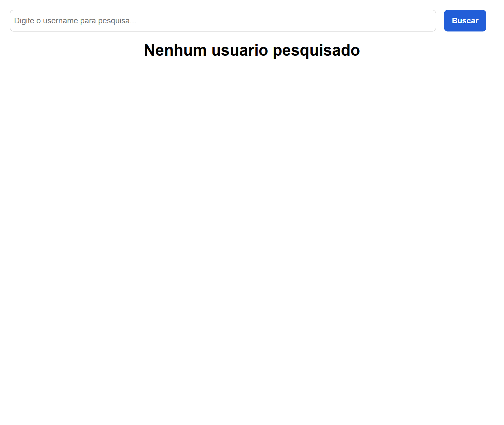
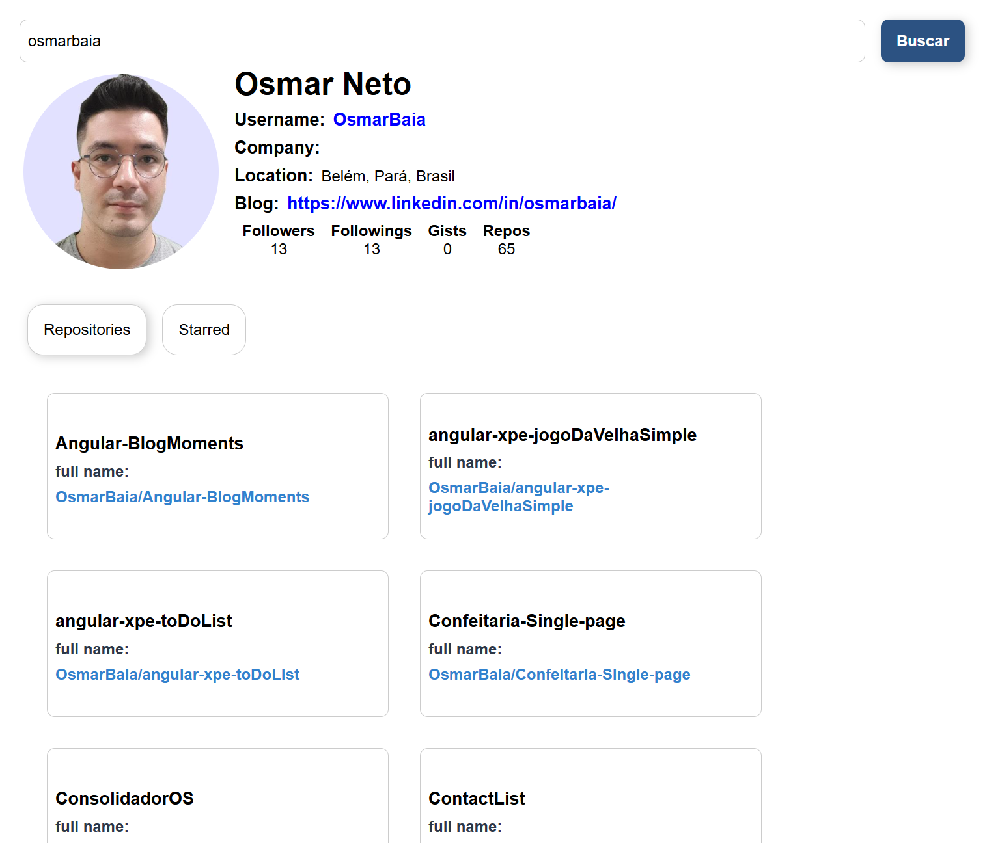

# Github API Interface com React

Desafio projeto do bootcamp Impulso JavaScript Evolution da plataforma Digital Innovation One, o qual consistiu em criar um front end componentizado em React.js utilizando styled-components, custom hook e context-api.

## Preview

